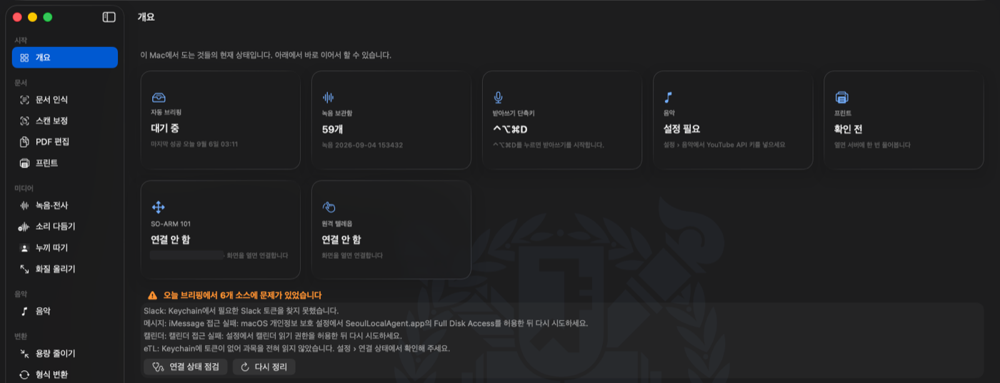
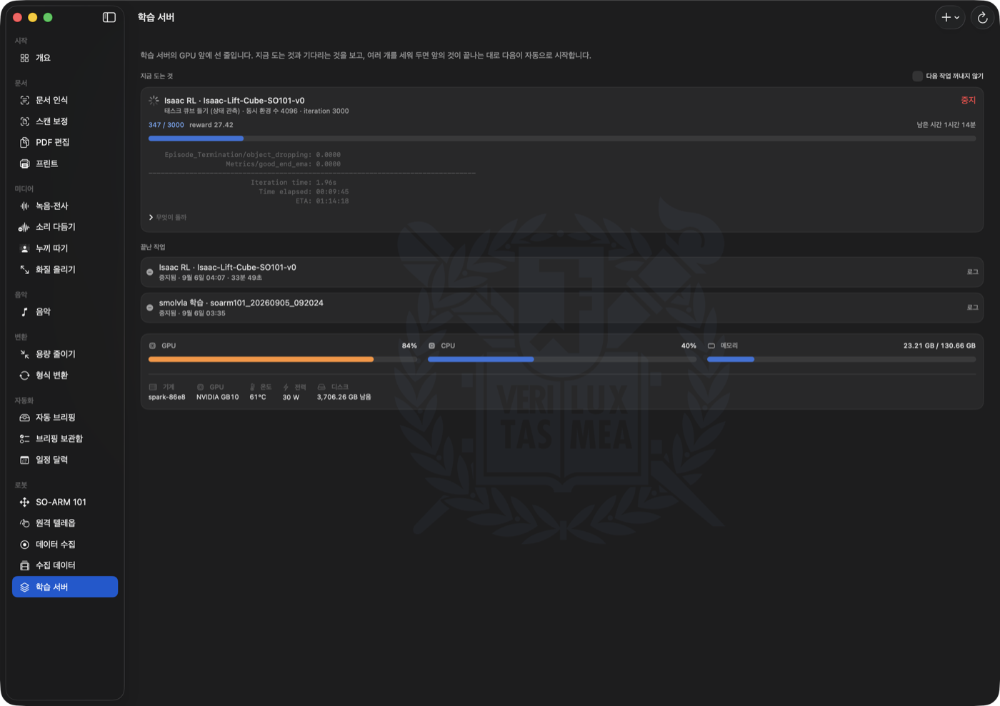
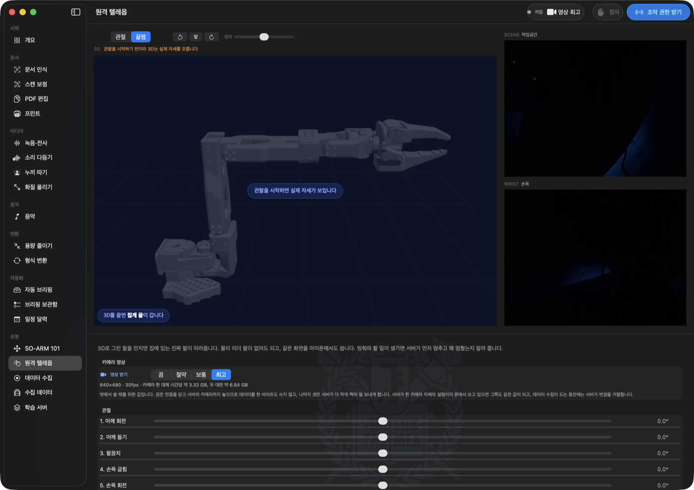
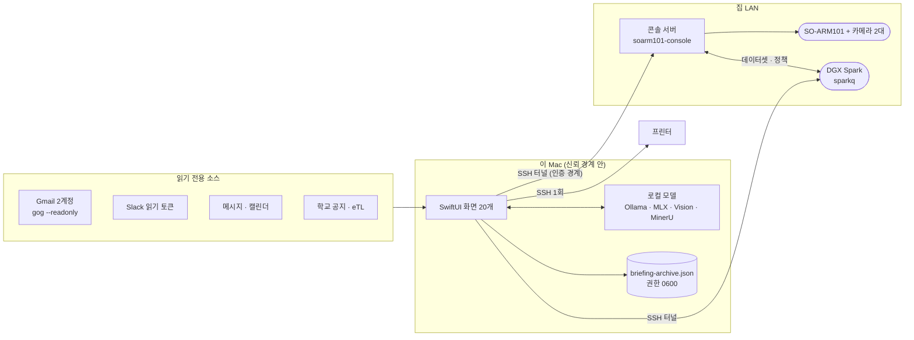

# 서울대 로컬 에이전트

Apple Silicon Mac에서 **전부 기기 안에서** 도는 개인 자동화 메뉴바 앱. 받은 메일·메시지와 학교
공지를 읽어 오늘 할 일로 정리하고, 녹음을 전사하고, 문서를 인식하고, 사진·영상을 다듬음.
집에 둔 서버의 로봇 팔과 학습 서버까지 이 앱 하나에서 조작함. 데이터가 이 Mac을 벗어나지 않는
것과, 사용자가 켜지 않은 것은 스스로 시작하지 않는 것을 설계 전제로 둠.

> *A menu-bar personal-automation app for Apple Silicon that runs entirely on-device. It reads mail,
> chat and university notice boards read-only, edits them into a daily briefing kept inside the app,
> and turns items into Calendar events. It also transcribes, parses documents, processes media, and
> drives a robot arm and a training server over an SSH tunnel. Nothing leaves the machine.
> Documentation is in Korean.*

<table>
<tr>
<td width="50%"></td>
<td width="50%"></td>
</tr>
<tr>
<td align="center"><sub><b>개요</b> — 마지막 성공 시각과 <b>실패한 소스를 첫 화면에서</b> 말함</sub></td>
<td align="center"><sub><b>학습 서버</b> — GB10 한 장 앞에 선 줄, 진행·남은 시간·실패 사유</sub></td>
</tr>
<tr>
<td width="50%"></td>
<td width="50%"></td>
</tr>
<tr>
<td align="center"><sub><b>원격 텔레옵</b> — 3D 팔을 끌면 집의 진짜 팔이 따라옴(물리 리더 불필요)</sub></td>
<td align="center"><sub><b>수집 데이터</b> — 리더가 시킨 자리(점선)와 팔로워가 실제로 있던 자리(실선)</sub></td>
</tr>
</table>

---

## 무엇을 하는가

| 기능 | 내용 |
|---|---|
| **인박스 정리** | Gmail 2계정 · Slack · 메시지 앱 · 캘린더 · 학교 공지 게시판 · **eTL 과목 공지와 과제 마감**을 **읽기 전용**으로 모아 `오늘 꼭 할 일` / `확인해야 할 것` / `기타`로 편집함 |
| **브리핑 보관함** | 정리 결과가 날짜별로 앱 안에 쌓임(최근 90일). 메일 원문 앞부분까지 화면에서 읽고, 체크·메모·검색·복사를 하고, 잘못 분류된 항목은 한 칸씩 옮기거나 그 항목만 다시 분석하고, 항목을 Mac 캘린더나 미리 알림으로 넘김 |
| **녹음·전사** | Qwen3-ASR(0.6B~1.7B, MLX)로 한국어 전사·타임스탬프, pyannote 화자 구분. 녹음에 이름과 과목·주제 태그를 붙여 거르고 묶어 봄 |
| **전역 받아쓰기** | 어느 앱에서든 단축키로 녹음 → 기기 내 변환 → 클립보드·커서 위치 삽입 |
| **문서 인식** | `빠름`은 macOS Vision, `정밀`은 MinerU로 수식을 LaTeX·표를 표로 살린 Markdown |
| **미디어 도구** | 누끼 따기(BiRefNet_HR-matting) · 화질 올리기 · 용량 줄이기 · 형식 변환 · 스캔 보정 · PDF 편집 |
| **음악** | YouTube에서 곡을 찾아 플레이리스트를 만들되, **소리는 광고가 없는 곳에서만** 냄 — 이 Mac의 음악 파일 · Audius · Internet Archive. 셋 다 없는 곡은 직접 고르거나 YouTube 폴백으로 재생하고, 어느 경로인지 목록에 적힘 |
| **프린트** | PDF·사진·문서를 던져 넣으면 집 서버에 USB로 붙은 프린터로 감. **미리보기가 실제로 나갈 파일 그대로**임 — 쪽 범위·모아찍기·회전을 CUPS가 아니라 이 Mac에서 파일에 적용하고 그 파일을 그림. 종이가 몇 장 나갈지 누르기 전에 세어 주고, 집에서도 밖에서도 같은 두 주소를 순서대로 시도함 |
| **SO-ARM 101** | 집 서버에 붙은 로봇 팔을 SSH 터널 너머로 조작함. 카메라 프리뷰·텔레옵·데이터 수집을 간추린 화면에서 하고, `전체화면`은 서버의 웹 콘솔을 그대로 띄움. 이전 세션이 남긴 토크도 여기서 풂 |
| **원격 텔레옵** | 3D로 그린 팔을 끌면 집의 진짜 팔이 따라옴. 맥에서는 관절 하나씩 정하거나 **집게 끝을 잡아 끌 수** 있고(역기구학), 물리 리더 팔은 필요 없음. 같은 화면을 아이폰에서 손가락으로 쓰며 홈 화면 앱으로 설치됨 — **폰에서는 끝점 하나이고 아래 조작판이 없음.** 속도는 서보 자신이 지키고, 무언가에 닿으면 서버가 모터가 타기 전에 물러난 뒤 멈추고 왜 멈췄는지 적음 |
| **데이터 수집** | VLA 학습용 시연을 찍음. 화질은 640×480@30으로 못 박혀 있고 고르는 자리가 없음 — 회차마다 설정이 달라지면 데이터셋을 못 쓰기 때문임 |
| **수집 데이터** | 서버에 쌓인 시연을 회차 단위로 되돌려 봄. 영상은 내려받지 않고 서버가 그 구간만 잘라 보냄. **학습 서버(DGX Spark)로 데이터셋을 보내고 학습된 정책을 회수함** — 전송은 콘솔 서버와 학습 서버 사이 LAN으로 흐르므로 맥이 집 밖에 있어도 느려지지 않고(6.2GB 실측 62초/64초), 끊긴 전송은 받다 만 곳부터 이어받음 |
| **학습 서버** | DGX Spark의 GPU 하나 앞에 선 줄. 지금 도는 학습의 진행·남은 시간과 대기열, 끝난 것과 실패 사유를 한 화면에서 봄. 여러 개를 세워 두면 앞의 것이 끝나는 대로 다음이 자동으로 시작함. LeRobot 정책 학습과 Isaac Lab 강화학습을 걸 수 있고, 걸 수 있는 종류와 그 칸은 서버가 정함 — 새 실험을 늘리는 데 앱을 고치지 않음. 큐는 Spark 위의 데몬이 들고 있어 이 앱을 꺼도 계속 돎 |
| **로컬 Codex** | Codex OSS/Ollama 읽기 전용 세션, 종료 시 모델 즉시 언로드 |

## 이 앱이 어디에 서 있나



**팔과 카메라의 소유자는 콘솔 서버 하나뿐임.** 앱에는 LeRobot도 serial 접근 코드도 넣지 않았고,
SSH 터널과 HTTP 클라이언트만 있음. 콘솔 API에 인증이 없으므로 신뢰 경계는 그 터널이다.

## 구성

```
Sources/SeoulLocalAgent/
  SeoulLocalAgentApp.swift    앱 진입점, 화면 전환, AutomationController(전 화면 공용 상태)
  Models.swift                수집 항목·분류 결과·화면 목록 같은 공용 타입
  Services.swift              Gmail·Slack·메시지·캘린더 수집과 로컬 모델 호출
  BriefingService.swift       수집 → 분류 → 이월 → 저장 파이프라인
  BriefingAutopilot.swift     사람이 손을 뗀 밤에 스스로 한 번 도는 조건(설정에서 켤 때만)
  BriefingArchive*.swift      브리핑 보관함: 저장 형식, 화면, 체크·메모·분류 교정·캘린더 연결
  ConnectionHealth.swift      각 소스에 실제로 닿는지 점검(설정 › 연결 상태, --connection-check)
  SOArmSession.swift          로봇 세션 하나의 수명: 터널 · 모드 소유 · 상태 폴링
  SOArmConsole.swift          콘솔 서버 REST 클라이언트(진단·텔레옵·수집·데이터셋·토크)
  SOArmScreen.swift           SO-ARM 101 화면: 카메라 프리뷰 · 안전 게이트 · 전체화면 콘솔
  SOArmVirtualLeader.swift    가상 리더 계약(관절 한계·안전 정책·거절 코드)과 REST 클라이언트
  SOArmTeleopModel.swift      30Hz WebSocket, 조작 권한(리스)과 하트비트, 3D 뷰어와의 다리
  SOArmTeleopScreen.swift     원격 텔레옵 화면: 3D(WKWebView) + 네이티브 슬라이더·부하·정지
  SOArmRecordScreen.swift     데이터 수집 화면: 과제·회차·구간(수집/정리/저장)·품질 지표
  SOArmDatasetsScreen.swift   수집 데이터 화면: 회차 재생, 관절 곡선, 전송·학습·삭제
  SparkQueue.swift            학습 큐 클라이언트(작업 종류·대기열·진행·로그), --spark-check
  SparkScreen.swift           학습 서버 화면: 도는 것 · 대기열 · 끝난 것 · 기계 상태
  SOArmTunnel.swift           집·밖 두 주소를 순서대로 시도하는 SSH 터널 하나
  MJPEGStream.swift           서버 카메라의 MJPEG 스트림 한 개를 최신 프레임으로
  Printing.swift              프린터로 가는 길: lpstat/lpoptions 읽기, lp 명령 만들기, SSH 한 번
  PrintPreparation.swift      사진·글·오피스 문서를 고른 용지·방향의 PDF로 (보내기 전에 이 Mac에서)
  PrintPreview.swift          쪽 범위·모아찍기·회전을 파일에 적용하고, 그 파일을 화면에 그린다
  PrintScreen.swift           프린트 화면: 드롭 · 프린터 상태 · 옵션 · 목록 · 서버 큐
  MusicModel.swift            곡·플레이리스트·보관함과 그 저장(계정 없음, 파일 하나)
  MusicSources.swift          카탈로그/재생 소스 계약과 제목 정리·맞추기 규칙(순수 함수)
  YouTubeCatalog.swift        YouTube Data API v3 — 검색·메타데이터·플레이리스트 전용
  FreeStreamSources.swift     Audius · Internet Archive (공개 API, 키 없음, 광고 없음)
  LocalMusicSource.swift      이 Mac의 음악 파일 색인과 태그 읽기
  PlaybackResolver.swift      한 곡을 광고 없는 음원으로 바꾸는 순서와 문턱
  MusicPlayerModel.swift      AVPlayer 재생·대기열·셔플/반복·후보 찾기·미리 듣기
  YouTubeEmbedPlayer.swift    폴백 전용 공식 임베드 플레이어(광고를 건드리지 않음)
  MusicScreen.swift           음악 화면: 보관함 레일 · 목록 · 대기열 · 아래 플레이어 · 음원 찾기
  RecordingOrganization.swift 녹음 이름과 태그
  CalendarWriting.swift       전용 캘린더·미리 알림 쓰기, 중복 방지
  DeadlineParsing.swift       한국어 마감 표기를 날짜로
  TriagePreparation.swift     분류 전 정제, 표시 문장, 이월 규칙
  BatchTool.swift / ToolKit.swift   파일 도구 공통 뼈대(큐·드롭·툴바·결과 카드)
  *Compression / Upscaling / ScanCorrection / PDFToolbox / FileConversion 등  도구별 구현
Tests/SeoulLocalAgentTests/   테스트 480개 (scripts/run-tests.sh로만 실행)
scripts/
  build-app-bundle.sh         .app 번들 생성과 서명
  run-tests.sh                테스트 진입점 (swift test를 직접 쓰면 안 됨)
  setup-*.sh                  기능별 Python 가상환경
  *_runner.py                 전사·누끼·미디어 상주 러너
  eval/                       분류 품질 측정용 합성 데이터와 스크립트
```

## 설계에서 신경 쓴 부분

- **조용한 실패를 만들지 않음.** Gmail 리프레시 토큰이 만료됐을 때 실행은 계속 `완료`로 끝났고,
  실패는 보관함 맨 아래 캡션 한 줄로만 남아 16일이 지나서야 드러났음. 지금은 개요의 타일이
  마지막 성공 시각과 며칠이 지났는지를 말하고, 실패한 소스는 날짜와 함께 첫 화면에 뜨며,
  `설정 › 연결 상태`가 각 소스에 실제로 한 번씩 읽기를 시도해 답을 보여 줌(고정 문자열이 아니라
  실제 시도임). 계정 하나가 실패해도 다른 계정의 메일은 버리지 않고, 모델이 없으면 Ollama가
  알려 준 이유를 그대로 전함. 위 첫 번째 화면이 그 결과임.
- **보안 경계를 관례가 아니라 코드로 강제함.** Gmail은 `gog --readonly` 두 계정만, Slack은
  Keychain의 읽기 토큰만 씀. 전송·수정·삭제·반응은 **구현되어 있지 않음.** 캘린더와 미리 알림은
  쓰기도 하지만 `서울대 로컬 에이전트`라는 전용 캘린더·목록에만 쓰고, 지우기 전에 그 캘린더가
  앱이 만든 것인지 다시 확인함. 원래 쓰던 일정은 만들지도 고치지도 지우지도 않음. Notion 쓰기는
  기본적으로 꺼져 있고 `Notion으로 내보내기`를 눌렀을 때만 일어나며, 그때도 지정한 부모 페이지의
  직접 하위로만 가능하고 코드에서 parent ID를 다시 검사함. 권한을 좁게 설정하는 것과 기능을
  아예 만들지 않는 것은 사고가 났을 때 결과가 다르기 때문임.
- **메시지 본문을 지시로 해석하지 않음.** 수집한 본문은 신뢰하지 않는 데이터로만 모델에 넘김.
  남이 보낸 메일이 이 에이전트의 시스템 프롬프트나 도구 실행으로 승격될 수 있으면, 받은편지함이
  곧 공격 표면이 되기 때문임.
- **하드웨어 소유자를 늘리지 않았음.** 로봇 팔은 집 서버가 serial과 카메라를 쥐고 있고, Mac이
  두 번째 소유자가 되면 같은 팔에 두 곳에서 명령이 들어감. 그래서 앱에는 LeRobot도 serial 접근
  코드도 넣지 않고, SSH 터널과 HTTP 클라이언트만 두었음. 앱은 서버를 LAN에 여는 방법을 제공하지
  않음. `SOARM_ENABLE_MOTION`·serial 경로·calibration을 바꾸는 화면도 **만들지 않았음** — 실수로
  장치 역할이 어긋나는 경로 자체를 없애는 편이 낫기 때문임. 사람에게 남는 게이트는 위험의 종류에
  맞춘 것 하나임 — 사람이 리더를 쥐고 있어야 팔이 움직이는 텔레옵·수집은 버튼 한 번, 팔이 혼자
  움직이는 재생과 팔이 힘을 놓는 토크 해제는 체크 한 번임.
- **서버가 할 수 있는 것을 이름으로 물어봄.** 화면을 켤 때 `/api/status`의 `capabilities`를 읽고,
  거기 이름이 있는 기능만 켬. 화면이 서버보다 앞서 나가면 사람은 눌리지 않는 단추를 보게 되고,
  서버가 앞서 나가면 새 기능이 아무에게도 보이지 않기 때문임. 서버에 기능을 더할 때 앱을 같이
  고쳐 배포하지 않아도 됨.
- **자식 프로세스가 뒤에 남지 않게 함.** 누끼·미디어 러너는 stdin EOF · 부모 PID 소멸 · 5분 유휴
  중 먼저 오는 조건에 스스로 종료하고, 앱을 강제 종료해도 함께 사라짐. 로봇 터널도 같은 규칙임:
  `ssh -N` 대신 원격에서 `cat`을 돌려 stdin EOF로 죽게 만들었고, 화면을 떠날 때·앱이 끝날 때
  명시적으로 내리며, 다음 실행이 남은 터널을 마커로 찾아 치움. MinerU는 자체 API 서비스를 손자
  프로세스로 띄우므로 중단·실패·종료 어느 경우에도 프로세스 트리 전체를 정리함.
- **분류와 한국어 문장을 한 번의 요청에서 만듦.** 요약을 2차 호출로 다시 다듬지 않기 때문에
  문장이 원문을 보면서 쓰이고, 항목당 실측 3.6~6.0초로 100건이 10분 안쪽에 끝남.
  (측정 방법은 `scripts/eval/README.md`)
- **광고를 막는 대신 광고가 없는 곳에서 소리를 냄.** 음악 탭은 YouTube로 시작했지만, 임베드
  플레이어에는 광고가 붙고 그것을 막는 코드는 약관 위반임. 전체 카탈로그·광고 없음·무료 세 가지를
  동시에 만족하는 합법적 방법은 존재하지 않으므로(무료 서비스는 광고로, 광고 없는 서비스는
  구독료로 비용을 낸다) 순서를 뒤집었음: YouTube는 **찾는 곳**으로만 쓰고, 소리는 광고가
  구조적으로 없는 세 곳 — 내 파일 · Audius · Internet Archive — 에서 냄. 셋 다 없는 곡만 공식
  임베드 플레이어로 폴백하고, **그 곡이 어느 경로인지 목록과 플레이어에 계속 적어 둠.** 광고
  차단도, 스트림 추출도, 플레이어를 가리는 코드도 넣지 않았음.
- **엉뚱한 곡을 조용히 틀지 않음.** 제목을 맞출 때 짧은 쪽만 기준으로 겹침을 재면 한 낱말짜리
  제목이 무엇에나 1.0으로 맞음. 실제로 `Chopin — Nocturne in E flat major`를 찾다가 다른
  아티스트의 `Nocturne`이 문턱을 넘었고, 실측 점검에서 잡았음. 지금은 양쪽 길이를 함께 세고
  재생 길이가 크게 어긋나면 깎음. 문턱을 넘지 못하면 아무것도 틀지 않음 — 사용자는 자기가 고른
  곡을 듣고 있다고 믿기 때문에, 다른 곡을 트는 것은 아무것도 틀지 않는 것보다 나쁘기 때문임.
- **결과가 앱 안에 남음.** 브리핑은 원래 Notion 페이지에 쓰였고, 다음 날 무엇이 남았는지도 그
  페이지의 체크박스를 되읽어서 정했음. 즉 인터넷이 없으면 앱이 자기가 만든 결과조차 볼 수 없었고,
  제목이 조금만 바뀌어도 이월 추적이 끊겼음. 지금은 `브리핑 보관함` 화면이 원본이고, 완료 여부는
  항목의 안정 ID로 `briefing-archive.json`(권한 0600)에 남음.
- **읽는 사람의 기준을 모델 뒤에서 한 번 더 확정함.** 관심 분야의 행사와 직접 신청할 수 있는
  장학 안내는 한 단계 올리고, 약관 개정 안내와 개인 프로젝트의 배포 실패 알림은 한 단계 내림.
  프롬프트에도 같은 기준을 적지만, 3B 활성 로컬 모델이 아침마다 수십 통을 읽는 동안 같은 종류가
  반복해서 어긋났음. 읽기가 아니라 알아보기만 하면 되는 판단은 결정적인 규칙이 낫고, 그래야
  `설정 → 분류 기준`을 고친 결과가 이미 저장된 브리핑에도 곧바로 보임. 한 칸씩만 움직임.
- **마감 문장을 날짜로 읽되, 애매하면 물음.** `9월 15일까지` · `내일 오후 6시` · `다음 주 금요일`
  같은 표기를 직접 해석해 캘린더에 넣음. `가급적 빨리`처럼 날짜가 아닌 말은 아예 해석하지 않고,
  시각만 적힌 경우처럼 확신이 없으면 날짜 선택기를 채워서 확인받음. 남의 캘린더에 조용히 들어간
  틀린 날짜는 날짜가 없는 것보다 나쁘기 때문임.
- **첫 공지 수집은 기준선만 저장하고 아무것도 보고하지 않음.** 게시판 앞면 전체가 새 글로 잡히면
  그날 브리핑이 묻히기 때문임. 새 글 판정도 날짜가 아니라 **글 주소**로 함. 게시판마다 날짜
  형식이 제각각이라 주소를 기억하는 편이 안정적이기 때문임.
- **남은 시간을 개수가 아니라 예상 소요 시간으로 셈.** 한 묶음에 2MP 스크린샷과 48MP 사진과
  10분짜리 영상이 섞여 들어오므로 개수로 세면 몇 배씩 틀림.
- **플랫폼 오작동을 우회함.** MinerU는 Apple Silicon에서 가용 메모리를 1GB로 잘못 읽어 한 번에 한
  쪽만 처리함. 앱이 물리 메모리의 1/4을 `MINERU_VIRTUAL_VRAM_SIZE`로 알려 주면 같은 문서가
  **288초에서 30초로** 줄어듦. 이 설정이 없으면 기능이 성립하지 않음.

## 실행

```zsh
chmod 700 scripts/local-codex scripts/build-app-bundle.sh scripts/setup-*.sh
scripts/build-app-bundle.sh
open dist/SeoulLocalAgent.app
```

선택 기능(누끼·문서 인식 `정밀`·소리 다듬기·영상 압축)은 각각 별도 셋업 스크립트와 brew 패키지가
필요함. 전체 절차와 Gmail 계정 설정은 [docs/사용_안내.md](docs/사용_안내.md)에 있음.

테스트는 반드시 `scripts/run-tests.sh`로 돌림. `swift test`를 직접 실행하면 `xcode-select`가
Command Line Tools를 가리킬 때 **테스트를 하나도 실행하지 않고 성공으로 끝남.**

## 문서

| 문서 | 내용 |
|---|---|
| [docs/사용_안내.md](docs/사용_안내.md) | 기능별 전체 설명, 화면 구성, 웹 공지 수집, 처음 실행, 권한, 모델·로그·제거 |
| [docs/원격_텔레옵_프로토콜.md](docs/원격_텔레옵_프로토콜.md) | 맥·폰·서버가 주고받는 계약(REST·WebSocket·단위·데드맨) |
| [docs/원격_텔레옵_안전.md](docs/원격_텔레옵_안전.md) | 안전 사다리의 문턱값과 근거, 아직 확인하지 못한 것 |
| [docs/학습_큐_계약.md](docs/학습_큐_계약.md) | 학습 큐가 주고받는 계약(작업 종류·진행·로그)과 `sparkq`와의 경계 |
| [docs/로봇_파이프라인_점검_2026-09-05.md](docs/로봇_파이프라인_점검_2026-09-05.md) | 팔부터 학습까지 한 번에 걸어 보고 나온 것들의 기록 |
| `scripts/eval/README.md` | 분류 파이프라인 속도·품질 측정 방법과 결과 |

## 관련 저장소

- [sesepark/soarm101-console](https://github.com/sesepark/soarm101-console) — 팔과 카메라를 쥔 콘솔 서버. 이 앱이 SSH 터널 너머로 부르는 상대
- [sesepark/sparkq](https://github.com/sesepark/sparkq) — `학습 서버` 화면이 읽는 큐. DGX Spark 위에서 돎

## 한계와 주의

- **macOS 26 이상, Apple Silicon 전용임.** Liquid Glass를 그대로 쓰려고 배포 타깃을 26으로 두었고,
  모델은 MLX 빌드라 Intel Mac에서는 동작하지 않음.
- **자동으로 도는 것은 하나뿐이고, 그것도 꺼져 있음.** 로그인 항목도 launchd 항목도 만들지 않음.
  예외는 `자동 브리핑`으로, **설정에서 직접 켠 경우에만** 돎 — 전원이 꽂혀 있고, 노트북이 열려
  있고, 20분 넘게 아무것도 누르지 않았고, 다른 작업이 돌고 있지 않은 밤에 하루 한 번임(2회 연속
  실패하면 중단). 켜지 않았으면 브리핑은 직접 눌러야 돌아감. 뚜껑을 닫으면 Mac이 잠들어 돌지
  않고, 예약 기상이나 launch agent는 설치하지 않음. 로그인·화면 열기·잠자기 해제로 시작하는
  일은 없음.
- Notion 연동은 남아 있지만 기본값이 꺼짐임. 보관함 툴바의 `Notion으로 내보내기`를 눌렀을 때만
  그날 브리핑이 올라감.
- 개인 설정(Gmail 주소, Notion 부모 페이지, Slack 토큰)은 저장소에 없음. 기기별 설정 파일과
  Keychain으로만 다루며, 넣는 방법만 문서에 적혀 있음.
- **로봇 화면은 서버가 켜져 있어야 쓸 수 있음.** 집 서버에서 `soarm-console.service`가 돌고 있어야
  하고, 앱이 만든 전용 공개키를 서버에 한 번 등록해야 함(`설정 › 로봇`의 `명령 복사`). 앱은 암호를
  묻지 않고 즉시 실패하며, macOS가 `~/.ssh`를 보호하기 때문에 평소 쓰는 열쇠는 앱이 읽지 못함.
  서버가 같은 랜에 있으므로 macOS의 **로컬 네트워크 접근**도 한 번 허용해야 함 — 허용하지 않으면
  터미널에서는 닿는 주소를 앱만 `No route to host`로 놓침. `모드 중지`는 소프트웨어 중지이며 물리
  E-stop을 대신하지 않음.
- Gmail은 계정당 최근 400스레드까지만 검색함. 상한에 닿으면 누락 가능성을 브리핑에 표시함.
- 학교 공지 게시판은 개편되면 조용히 0건이 됨. `--web-notices-check`로 어느 게시판이 살아 있는지
  확인할 수 있음. 사범대·생활과학대·의대·치의학대학원 네 곳은 목록이 자바스크립트로만 그려지거나
  링크가 `javascript:` 호출이라 읽을 수 없어 꺼 두었음.
- **기기별 절대 경로가 코드에 박혀 있음.** Python 러너와 셋업 스크립트가
  `/Users/sehwan/Projects/local_llm/...`을 그대로 참조하므로, 다른 경로에 두면 전사·누끼·소리
  다듬기·문서 인식 `정밀`이 동작하지 않음. 본인 Mac 한 대에서 쓰려고 만든 도구라 아직 정리하지 않았음.
